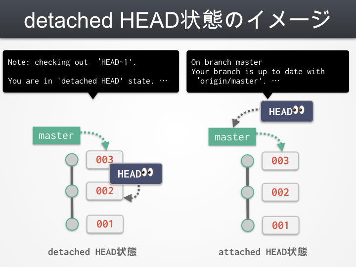
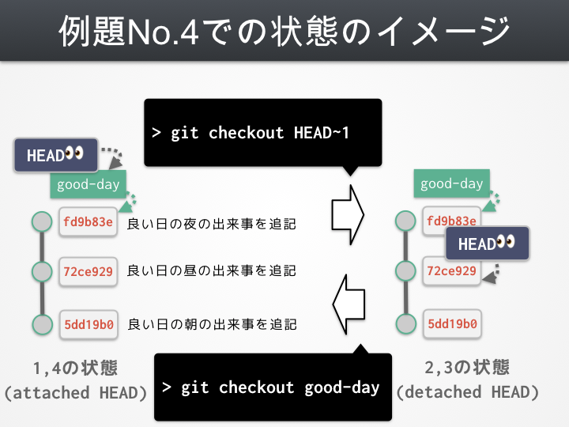

# detached HEAD | ブランチから外れる

## 難易度 :star: :star:

:bulb:  _"detached HEAD"はgitコマンドではありません、練習問題にてdetached HEADを再現するための手順を学習しましょう_

## 概要



- **ブランチから外れた場合に "You are in 'detached HEAD' state." というメッセージが表示される**
- **新規にブランチを作成するか適当なブランチをcheckoutすることでdetached HEAD状態を回避 = attached HEAD状態に戻ること出来る**
- gitにおけるbranchとは「commitを指すポインタ」
- HEADとは現在自分が見ているcommitまたはbranchを指す「ポインタ」
- つまり "detached HEAD" 状態とは「HEADがbranchを指してない状態 = 単独のコミットを指している」状態を指す

## 例題 (リポジトリ: [git-drill/detached-head](https://github.com/git-drill/detached-head))

1. :mag: このリポジトリではある日の業務日報が記された `report.txt` が管理されています。
2. :mag: また3つのブランチが存在します。
  - `master` (= checkout直後のブランチ)
  - `good-day` (良いことがあった日に書かれた日報)
  - `bad-day` (悪いことがあった日に書かれた日報)
3. :octocat: 各ブランチをcheckoutしたときに `detached HEAD` 状態にならないことを確めてください。
4. :octocat: `good-day` ブランチをcheckoutした後に以下のコマンドを順に実行することで、 `detached HEAD` 状態になった後 `detached HEAD` 状態ではなくなることを確かめてください。またその時の状態をページ先頭にあるような図で説明してみましょう。
  1. `git checkout HEAD~1`
  2. `git status`
  3. `git checkout good-day`
5. :octocat: `bad-day` ブランチをcheckoutした後に以下のコマンドを順に実行することで、 `detached HEAD` 状態になった後 `detached HEAD` 状態ではなくなることを確かめてください。またその時の状態をページ先頭にあるような図で説明してみましょう。
  1. `git checkout HEAD~2`
  2. `git status`
  3. `git checkout -b soso-day`

## 例題回答(No.3)

1. `git checkout good-day` を実行し以下の表示が出ることを確認。
```
Switched to branch 'good-day'
```
2. 続けて `git status` を実行し、 **detached HEADのメッセージが表示されないことを確認。**
```
On branch good-day
nothing to commit, working tree clean
```
3. 上記 1. と 2. の手順を `bad-day` と `master` に対しても実行し表示を確認

## 例題解説(No.3)

この例題で行った処理はすべて既存のブランチをcheckout作業する作業です。
したがってHEAD(自分が今見ている対象)はブランチのみのためdetached HEAD状態にはなりません。

## 例題回答(No.4)

1. `git checkout good-day`
2. `git checkout HEAD~1` で **"You are in 'detached HEAD' state."の表示が出ることを確認。**
```
Note: checking out 'HEAD~1'.

You are in 'detached HEAD' state. You can look around, make experimental
changes and commit them, and you can discard any commits you make in this
state without impacting any branches by performing another checkout.

If you want to create a new branch to retain commits you create, you may
do so (now or later) by using -b with the checkout command again. Example:

  git checkout -b <new-branch-name>

HEAD is now at 72ce929 良い日の昼の出来事を追記
```
3. `git status` で次のメッセージが表示されることを確認。
```
HEAD detached at 72ce929
nothing to commit, working tree clean
```
4. `git checkout good-day` で以下の表示になり**detached HEADのメッセージが表示されないことを確認。**
```
Previous HEAD position was 72ce929 良い日の昼の出来事を追記
Switched to branch 'good-day'
```

_状態のイメージ図は下の解説にて_

## 例題解説(No.4)

1. では `good-day` ブランチを見ている状態なのでdetached HEAD状態ではありません
2.  `git checkout HEAD~1` で行った操作の詳細は以下のとおりです。
  - `HEAD~1` は**「今見ている場所から1つ手前のコミット」**を指しています。
  - つまりこのコマンドは『「お昼の出来事を追記」のコミット(72ce929)に移動せよ』という意味になります。
  - 「お昼の出来事を追記」のコミット(72ce929)にはどのブランチも指していません。
  - したがって**HEADはブランチではなく特定のcommitを見ている状態となるため 'detached HEAD' になります。**
3. statusでも改めてdetached HEAD状態であることが確認できます。
4. ここで再度 `good-day` **ブランチ**をcheckoutするため、HEADが再度ブランチを指した状態となり**detached HEAD状態ではなくなりました。**

上記1から4の状態を図にするとこのようなイメージになります。



### No.5

1. `git checkout bad-day`
2. `git checkout HEAD~2` で **"You are in 'detached HEAD' state."の表示が出ることを確認。**
```
Note: checking out 'HEAD~2'.

You are in 'detached HEAD' state. You can look around, make experimental
changes and commit them, and you can discard any commits you make in this
state without impacting any branches by performing another checkout.

If you want to create a new branch to retain commits you create, you may
do so (now or later) by using -b with the checkout command again. Example:

  git checkout -b <new-branch-name>

HEAD is now at 662c712 悪い日の朝の出来事を追記
```
3. `git status` で次のメッセージが表示されることを確認。
```
HEAD detached at 662c712
nothing to commit, working tree cleau
```
4. `git checkout -b soso-day` で以下の表示になり**detached HEADのメッセージが表示されないことを確認。**
```
Switched to a new branch 'soso-day'
```

_状態のイメージ図は下の解説にて_

### 例題解説(No.5)


## 参考リンク

- [detached HEADを理解して脱Git初心者を目指す方のためのGit入門勉強会 @サポーターズCoLab \- Speaker Deck](https://speakerdeck.com/imaizume/detached-headwoli-jie-sitetuo-gitchu-xin-zhe-womu-zhi-sufang-falsetamefalsegitru-men-mian-qiang-hui-at-sapotazucolab)

